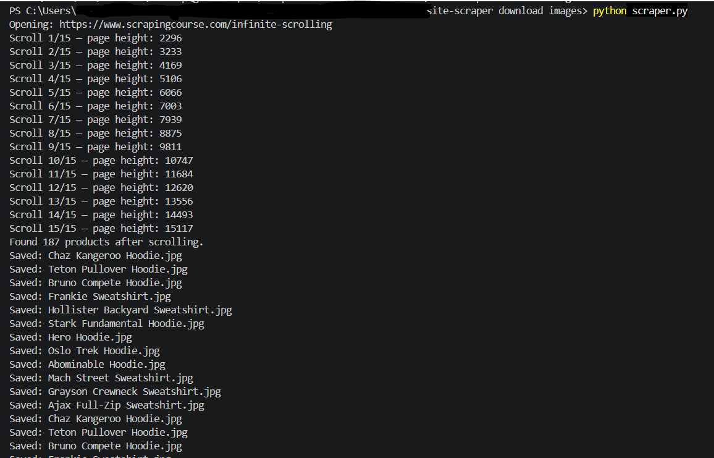
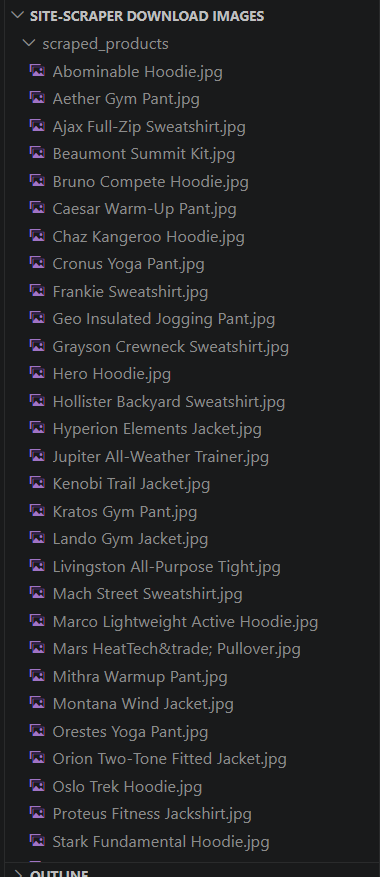

# Site Image Scraper

Two standalone scrapers (Python + PHP) for automatically pulling listing images from websites — one built for JavaScript-rendered, scroll-loaded content, and one for simpler server-rendered pages.

## Demo

Tested against [ScrapingCourse's Infinite Scrolling playground](https://www.scrapingcourse.com/infinite-scrolling) — a JS-rendered product grid built for scraping practice.

**Terminal output:**


**Downloaded images:**


## Scripts

### `scraper.py` — Playwright-based scraper (JS-rendered sites)
Automates a real Chromium browser to scroll through a JavaScript-rendered product grid and download images as they load.

**What it does:**
- Launches a stealth-configured Chromium session (`playwright-stealth` v2.x) to reduce automation fingerprinting
- Scrolls to the bottom of the page repeatedly, waiting for new content to load, until page height stops changing (or a scroll limit is hit)
- Extracts product images and names directly from the loaded grid
- Downloads images with a configurable cap (`MAX_DOWNLOADS`) so it doesn't run indefinitely
- Skips and logs any individual image that fails to download, rather than crashing the whole run

**Stack:** Python, Playwright, playwright-stealth

**Usage:**
```bash
python scraper.py
```
Configure `BASE_URL`, `TARGET_PATH`, `PRODUCT_SELECTOR`, `MAX_SCROLLS`, and `MAX_DOWNLOADS` at the top of the file.

**Known limitations:**
- Selectors (`PRODUCT_SELECTOR`, `IMAGE_PATH_MARKER`) are specific to the demo site's HTML structure — pointing this at a different site requires inspecting that site's actual class names and updating the config
- If the target catalog repeats items (as this demo site does), duplicate product names will overwrite each other on disk rather than erroring — a production version would need unique filenames (e.g. via a hash or counter suffix)
- `playwright-stealth` only defeats basic fingerprint checks (like `navigator.webdriver`); it does not bypass enterprise anti-bot systems (Cloudflare Turnstile, DataDome, etc.)
- No retry/backoff logic — a failed image download is skipped, not retried
- Runs with a visible browser window (`headless=False`) by default; switching to headless mode is possible but increases the chance of being flagged as a bot

### `bot.php` — Lightweight HTTP scraper (server-rendered sites)
A no-browser alternative using PHP's native HTTP context and DOMXPath, for sites that serve content directly in the initial HTML response.

**What it does:**
- Fetches a search results page with spoofed headers (User-Agent, Referer) to mimic a normal browser request
- Parses result links via XPath, visits up to a configurable number of listings (`$maxResults`)
- Extracts carousel images per listing via XPath and saves them locally
- Logs every step with timestamps to `activity.log`

**Stack:** PHP (DOMDocument, DOMXPath, stream contexts)

**Usage:**
```bash
php bot.php "search term"
```

**Known limitations:**
- Cannot render JavaScript — if a target site loads content client-side, this script fails to find anything, since it only sees the raw server HTML. I confirmed this while testing against a JS-heavy classifieds site, where the script couldn't get past the site's client-side rendering and returned no results (see `activity.log`)
- XPath selectors (`result-link`, `carousel`) are specific to whichever site's structure they were written against — a new target needs its HTML inspected and selectors rewritten
- SSL verification is disabled (`verify_peer => false`) to avoid certificate issues during scraping — a reasonable simplification for a demo/practice tool, but not something you'd want in production without re-enabling it
- No retry logic — a failed fetch just logs and moves on

## Why I built this
Automated data collection from listing-style websites — a precursor to building structured datasets from unstructured web sources, and related to lead-generation and dealership-listing work.

## Notes
- Always check a target site's `robots.txt` and terms of service before scraping it.
- Built and tested with rate-limiting/delay logic to run responsibly rather than hammering a target site with requests.